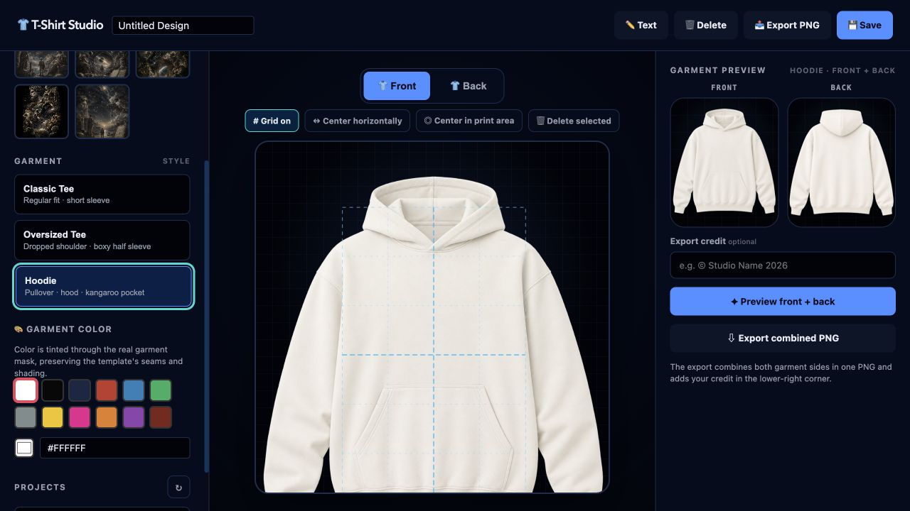

# 👕 T-Shirt Design Studio

A web-based T-shirt design tool that lets you create custom designs with drag-and-drop, image upload, and mockup generation.

## Features

- 🎨 **Canvas Editor** - Drag, drop, resize, rotate images on a T-shirt template
- 📤 **Image Upload** - Import PNG, JPG, SVG, WebP files
- 👕 **Front & Back** - Design both sides independently
- 🎨 **Color Picker** - Choose from preset colors or custom hex
- ✏️ **Text Tool** - Add custom text with font options
- 🧍 **Mockup Preview** - Generate mockup on a T-shirt template
- 💾 **Save/Load** - Projects persist in SQLite database
- 👔 **Garment Templates** - Design on realistic Classic Tee, Oversized Tee, and Hoodie front/back templates
- 📐 **Alignment Guides** - Use the full-garment grid, center horizontally without changing height, or center within the safe print area

## Alignment controls

The design canvas includes a full-garment grid for checking placement. Choose **Center horizontally** to correct only left/right alignment while preserving the layer's vertical position, or choose **Center in print area** to reset the layer to the exact print-area center.



## Tech Stack

| Layer | Technology |
|-------|-----------|
| Frontend | React 19 + TypeScript + Fabric.js 6 |
| Backend | FastAPI + SQLAlchemy + Pillow |
| Database | SQLite (async) |
| Container | Docker + Docker Compose |

## Quick Start

```bash
# Clone the repo
git clone https://github.com/Fernlizer/tshirt-designer.git
cd tshirt-designer

# Start with Docker
docker compose up --build

# Access the app
# Frontend: http://localhost:9005
# Backend API: http://localhost:9004
# API Docs: http://localhost:9004/docs
```

## Ports

| Service | Port |
|---------|------|
| Frontend | 9005 |
| Backend API | 9004 |

## API Endpoints

| Method | Path | Description |
|--------|------|-------------|
| POST | `/api/upload` | Upload image |
| GET | `/api/images` | List uploaded images |
| DELETE | `/api/images/{filename}` | Delete image |
| POST | `/api/projects` | Create project |
| GET | `/api/projects` | List projects |
| GET | `/api/projects/{id}` | Get project |
| PUT | `/api/projects/{id}` | Update project |
| DELETE | `/api/projects/{id}` | Delete project |
| POST | `/api/mockup/generate` | Generate mockup |

## Development

```bash
# Backend only
cd backend
pip install -e .
uvicorn app.main:app --reload --port 9004

# Frontend only
cd frontend
npm install
npm run dev
```

## License

MIT
